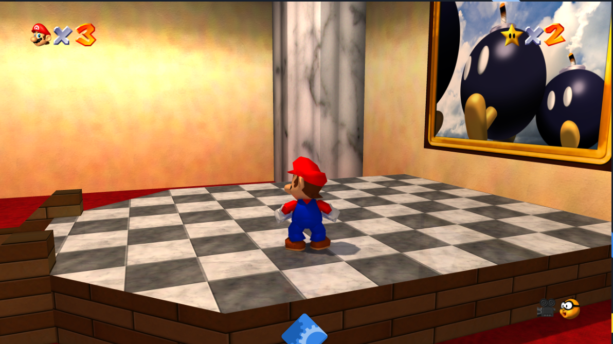
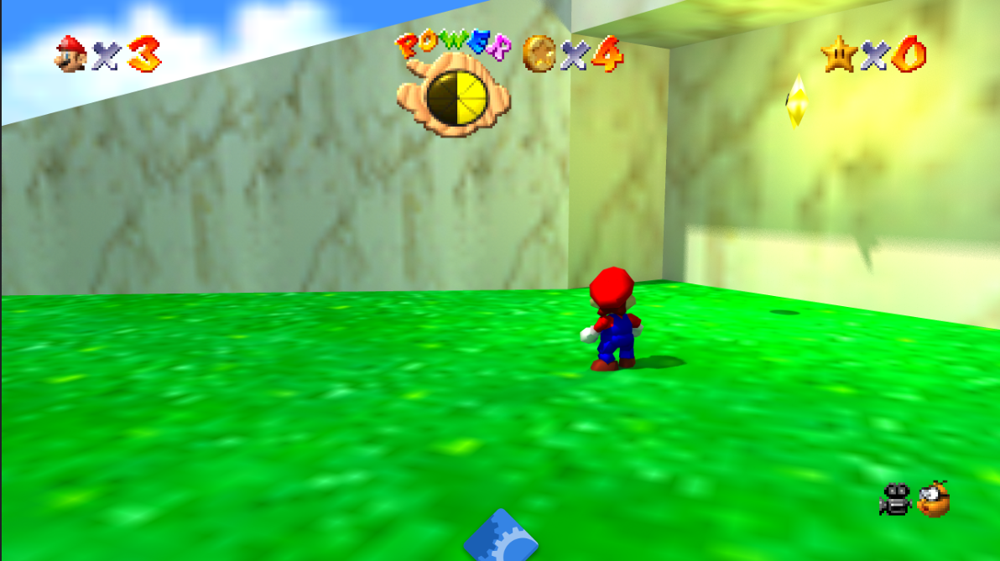
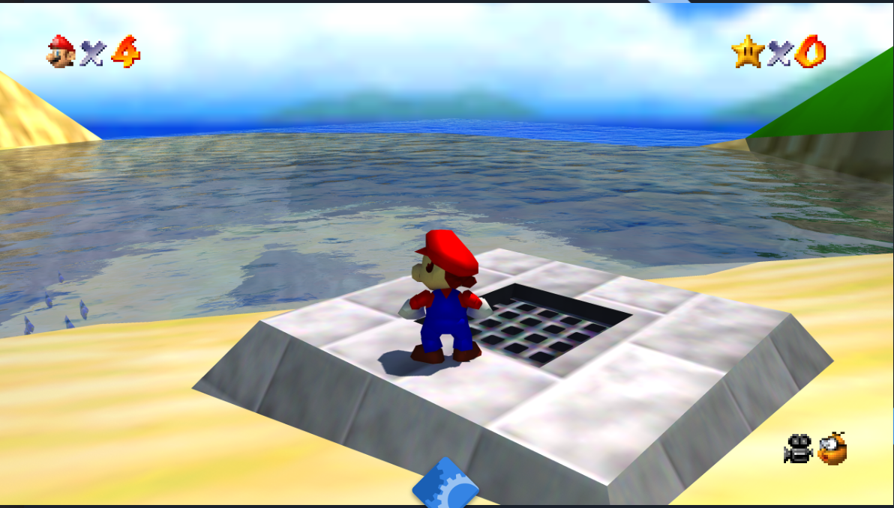

# SM64 RT64 Path Tracing on Linux

Run Super Mario 64 with real-time path tracing on Linux using Wine, a patched vkd3d-proton, and DXVK.

This repo provides:
- **sm64rt** — Vanilla SM64 textures + RT64 path tracing
- **Render96ex RT64** — HD textures + HD models + RT64 path tracing





## ⚡ Quick Install (One Command, Multi-Distro)

```bash
curl -sL https://raw.githubusercontent.com/danielbanariba/sm64rt-linux-guide/main/install.sh | bash -s -- /path/to/baserom.us.z64
```

**Auto-detects your distro** and installs dependencies via the right package manager:

| Distro family | Detected from | Package manager |
|---------------|---------------|-----------------|
| Arch (CachyOS, Manjaro, EndeavourOS) | `arch`, `cachyos`, `manjaro`, `endeavouros` | `pacman` + `yay`/`paru` |
| Debian (Ubuntu, Mint, Pop!_OS) | `debian`, `ubuntu`, `linuxmint`, `pop` | `apt-get` |
| Fedora (RHEL, CentOS, Rocky, AlmaLinux) | `fedora`, `rhel`, `centos`, `rocky`, `almalinux` | `dnf` |
| openSUSE (Leap, Tumbleweed) | `opensuse`, `suse` | `zypper` |

Or clone and run:
```bash
git clone https://github.com/danielbanariba/sm64rt-linux-guide.git
cd sm64rt-linux-guide
./install.sh /path/to/baserom.us.z64
```

The installer handles **everything**: deps, SDL2, vkd3d-proton patch + build, sm64rt build, Render96ex RT64 build, Wine prefix, DXVK, VC++ runtime, gamepad DB, launchers. Takes ~20 minutes total. After that:

```bash
~/build/sm64rt-linux/run-sm64rt.sh           # vanilla + RT
~/build/sm64rt-linux/run-render96-rtx.sh     # HD textures/models + RT
```

**Optional flags:**
- `SKIP_RENDER96=1 ./install.sh ROM` — skip the Render96ex build (faster, smaller)
- `SKIP_DEPS=1 ./install.sh ROM` — skip pacman/yay (if already installed)
- `BUILD_DIR=/custom/path ./install.sh ROM` — install elsewhere

---

## Manual Installation (if you want to understand each step)

## Requirements

- **OS**: Arch Linux (tested on CachyOS kernel 6.19.12)
- **GPU**: NVIDIA RTX series (tested on RTX 3090 Ti, driver 595.58)
- **ROM**: `baserom.us.z64` — US version of Super Mario 64 (SHA-1: `9bef1128717f958171a4afac3ed78ee2bb4e86ce`). You must legally dump this from your own cartridge.

## The Problem We Solved

RT64 (the path tracing renderer) calls `DispatchRays` without explicitly calling `SetComputeRootSignature`. Native Windows D3D12 drivers handle this implicitly, but vkd3d-proton (the D3D12-to-Vulkan translator used by Wine/Proton) strictly requires it — silently dropping every ray dispatch and producing black frames.

**Our fix**: [vkd3d-proton PR #2940](https://github.com/HansKristian-Work/vkd3d-proton/pull/2940) — adds implicit root signature binding as a fallback when none is set.

## Step 1: Install Dependencies

```bash
# Build tools + MinGW cross-compiler
sudo pacman -S --needed base-devel git python mingw-w64-gcc mingw-w64-binutils \
  mingw-w64-crt mingw-w64-headers mingw-w64-winpthreads make wine winetricks meson ninja glslang

# From AUR
yay -S --needed vkd3d-proton-mingw-git mingw-w64-glew
```

## Step 2: Download SDL2 MinGW Development Libraries

```bash
mkdir -p ~/build/sdl2-mingw && cd ~/build/sdl2-mingw
curl -sL -o SDL2-devel-mingw.tar.gz \
  "https://github.com/libsdl-org/SDL/releases/download/release-2.30.10/SDL2-devel-2.30.10-mingw.tar.gz"
tar xzf SDL2-devel-mingw.tar.gz
```

Fix the `sdl2-config` script paths — edit `SDL2-2.30.10/x86_64-w64-mingw32/bin/sdl2-config`:
- Change `--cflags` to output `-I${prefix}/include -I${prefix}/include/SDL2 -Dmain=SDL_main`
- Change `--libs` to output `-L${libdir} -lmingw32 -lSDL2main -lSDL2 -mwindows`

## Step 3: Build sm64rt

```bash
cd ~/build
git clone https://github.com/DarioSamo/sm64rt.git
cp /path/to/baserom.us.z64 sm64rt/baserom.us.z64
cd sm64rt
```

### Apply cross-compilation fixes

1. **Case-sensitive includes** — change `Windows.h` to `windows.h` in:
   - `include/rt64/rt64.h`
   - `src/pc/gfx/gfx_rt64_context.h`

2. **Missing stdio.h** — add `#include <stdio.h>` after `#include <SDL2/SDL.h>` in `src/pc/audio/audio_sdl2.c`

3. **GCC 15 compatibility** — add to the Windows CFLAGS in `Makefile`:
   ```
   -Wno-error=int-conversion -Wno-error=incompatible-pointer-types -Wno-error=implicit-function-declaration
   ```

### Compile

```bash
make -j$(nproc) VERSION=us RENDER_API=RT64 EXTERNAL_DATA=1 WINDOWS_BUILD=1 \
  CROSS=x86_64-w64-mingw32- CC=x86_64-w64-mingw32-gcc CXX=x86_64-w64-mingw32-g++ \
  LD=x86_64-w64-mingw32-g++ AS=x86_64-w64-mingw32-as \
  OBJCOPY=x86_64-w64-mingw32-objcopy OBJDUMP=x86_64-w64-mingw32-objdump \
  TARGET_ARCH=i386pe TARGET_BITS=64 NO_BZERO_BCOPY=1 \
  SDLCONFIG=$HOME/build/sdl2-mingw/SDL2-2.30.10/x86_64-w64-mingw32/bin/sdl2-config
```

Copy `SDL2.dll` to `build/us_pc/`:
```bash
cp ~/build/sdl2-mingw/SDL2-2.30.10/x86_64-w64-mingw32/bin/SDL2.dll build/us_pc/
```

## Step 4: Build Render96ex RT64 (optional, HD textures + models)

```bash
cd ~/build
git clone --branch tester_rt64alpha https://github.com/Render96/Render96ex.git render96-rt
cp /path/to/baserom.us.z64 render96-rt/baserom.us.z64
cd render96-rt
```

Download assets:
```bash
git clone --depth 1 --branch models_vanilla https://github.com/Render96/ModelPack.git /tmp/ModelPack
cp -r /tmp/ModelPack/Render96/* actors/
git clone --depth 1 https://github.com/pokeheadroom/RENDER96-HD-TEXTURE-PACK.git /tmp/HDTextures
curl -sL -o /tmp/dynos.7z "https://github.com/Render96/ModelPack/releases/download/3.25/Render96_DynOs_v3.25.7z"
```

Apply the same fixes as sm64rt (Windows.h, stdio.h, GCC 15 flags), then:

```bash
# Build native tools first
CC=gcc CXX=g++ make -C tools -j$(nproc)

# Extract ROM assets
python3 extract_assets.py us

# Cross-compile
make -j$(nproc) VERSION=us RENDER_API=RT64 EXTERNAL_DATA=1 TEXTURE_FIX=1 \
  WINDOWS_BUILD=1 NOEXTRACT=1 CROSS=x86_64-w64-mingw32- \
  CC=x86_64-w64-mingw32-gcc CXX=x86_64-w64-mingw32-g++ \
  LD=x86_64-w64-mingw32-g++ AS=x86_64-w64-mingw32-as \
  OBJCOPY=x86_64-w64-mingw32-objcopy OBJDUMP=x86_64-w64-mingw32-objdump \
  TARGET_ARCH=i386pe TARGET_BITS=64 NO_BZERO_BCOPY=1 \
  SDLCONFIG=$HOME/build/sdl2-mingw/SDL2-2.30.10/x86_64-w64-mingw32/bin/sdl2-config

# Copy runtime files
cp ~/build/sdl2-mingw/SDL2-2.30.10/x86_64-w64-mingw32/bin/SDL2.dll build/us_pc/
cp -r /tmp/HDTextures/gfx build/us_pc/res/
7z x -o"build/us_pc/dynos/packs/" /tmp/dynos.7z -y
```

## Step 5: Build Patched vkd3d-proton

Until [PR #2940](https://github.com/HansKristian-Work/vkd3d-proton/pull/2940) is merged upstream, you need to build vkd3d-proton from source with the fix.

```bash
git clone https://github.com/danielbanariba/vkd3d-proton.git ~/build/vkd3d-proton-patched
cd ~/build/vkd3d-proton-patched
git checkout fix/dxr-implicit-root-signature
git submodule update --init --recursive
./package-release.sh master ~/build/vkd3d-output --no-package
```

## Step 6: Setup Wine Prefix

```bash
export WINEPREFIX=~/.wine-sm64rt

# Create prefix
WINEDLLOVERRIDES="mscoree=" wineboot -u

# Install patched vkd3d-proton
cp ~/build/vkd3d-output/vkd3d-proton-master/x64/d3d12.dll ~/.wine-sm64rt/drive_c/windows/system32/
cp ~/build/vkd3d-output/vkd3d-proton-master/x64/d3d12core.dll ~/.wine-sm64rt/drive_c/windows/system32/

# Install DXVK (for dxgi.dll — required to replace Wine's broken dxgi)
curl -sL -o /tmp/dxvk.tar.gz "https://github.com/doitsujin/dxvk/releases/download/v2.7.1/dxvk-2.7.1.tar.gz"
tar xzf /tmp/dxvk.tar.gz -C /tmp
cp /tmp/dxvk-2.7.1/x64/dxgi.dll ~/.wine-sm64rt/drive_c/windows/system32/

# Set DLL overrides
WINEPREFIX=~/.wine-sm64rt wine reg add "HKCU\Software\Wine\DllOverrides" /v dxgi /d native,builtin /f

# Install VC++ runtime
WINEPREFIX=~/.wine-sm64rt winetricks -q vcrun2019 vcrun2022 d3dcompiler_47
```

## Step 7: Run

### sm64rt (vanilla textures + RT)
```bash
#!/usr/bin/env bash
export WINEPREFIX="$HOME/.wine-sm64rt"
export VKD3D_CONFIG=dxr
export WINEDLLOVERRIDES="dxgi=n,b"
export DXVK_HUD=fps
cd ~/build/sm64rt/build/us_pc
exec wine sm64.us.f3dex2e.exe
```

### Render96ex RT64 (HD textures + HD models + RT)
```bash
#!/usr/bin/env bash
export WINEPREFIX="$HOME/.wine-sm64rt"
export VKD3D_CONFIG=dxr
export WINEDLLOVERRIDES="dxgi=n,b"
export DXVK_HUD=fps
cd ~/build/render96-rt/Render96ex/build/us_pc
exec wine sm64.us.f3dex2e.exe
```

## 8BitDo Controller Support

Add these environment variables to your launch script:
```bash
export SDL_GAMECONTROLLERCONFIG_FILE="$HOME/build/sm64rt/gamepad/gamecontrollerdb.txt"
export SDL_JOYSTICK_HIDAPI=1
export SDL_JOYSTICK_HIDAPI_8BITDO=1
export SDL_JOYSTICK_RAWINPUT=0
```

Download the community gamecontrollerdb:
```bash
curl -sL -o ~/build/sm64rt/gamepad/gamecontrollerdb.txt \
  "https://raw.githubusercontent.com/mdqinc/SDL_GameControllerDB/master/gamecontrollerdb.txt"
```

If your 8BitDo Ultimate Wireless (2dc8:3109) Y-axis doesn't work, add this line to the db file:
```
03000000c82d00000931000000000000,8BitDo Ultimate Wireless 2.4G,a:b0,b:b1,back:b10,dpdown:h0.4,dpleft:h0.8,dpright:h0.2,dpup:h0.1,guide:b12,leftshoulder:b6,leftstick:b13,lefttrigger:a5,leftx:a0,lefty:a1,rightshoulder:b7,rightstick:b14,righttrigger:a4,rightx:a2,righty:a3,start:b11,x:b3,y:b4,platform:Windows,
```

**Important**: Unplug and replug the USB dongle before each launch if the controller doesn't respond.

## RT64 Config Options

Edit `~/.wine-sm64rt/drive_c/users/<you>/AppData/Roaming/sm64ex/sm64config.txt`:

```
rt64_gi true              # Global Illumination
rt64_denoiser true        # Denoiser (reduces noise)
rt64_sphere_lights true   # Dynamic lights on objects
rt64_max_lights 12        # Simultaneous light sources
rt64_target_fps 60        # FPS target
rt64_upscaler 0           # 0=off, 2=FSR (DLSS doesn't work via Wine)
```

## Known Limitations

- **DLSS doesn't work** — DXVK masks the NVIDIA GPU vendor for XeSS compatibility, which breaks DLSS initialization. Use FSR (`rt64_upscaler 2`) or native resolution instead.
- **Controller quirks** — 8BitDo controllers in proprietary mode (VID 2dc8) only expose hidraw on Linux, not evdev. SDL2 HIDAPI handles this but Wine's HID translation can lose the Y-axis. The gamecontrollerdb mapping fixes this.
- **First launch is slow** — vkd3d-proton compiles DXR shader pipelines on first run (30-60 seconds). Subsequent launches use the cached pipelines.

## Related Links

- [vkd3d-proton PR #2940](https://github.com/HansKristian-Work/vkd3d-proton/pull/2940) — Our fix for DXR DispatchRays without SetComputeRootSignature
- [sm64rt Issue #79](https://github.com/DarioSamo/sm64rt/issues/79) — Bug report for missing SetComputeRootSignature
- [sm64rt](https://github.com/DarioSamo/sm64rt) — SM64 with RT64 path tracing
- [Render96ex](https://github.com/Render96/Render96ex) — SM64 with HD textures and models
- [RT64](https://github.com/rt64/rt64) — The path tracing renderer
- [vkd3d-proton](https://github.com/HansKristian-Work/vkd3d-proton) — D3D12 to Vulkan translation

## Credits

- **DarioSamo** — RT64 renderer and sm64rt
- **Render96 team** — HD textures and models
- **vkd3d-proton team** — D3D12 to Vulkan translation
- **danielbanariba** — Linux cross-compilation, vkd3d-proton bug discovery and fix, guide
